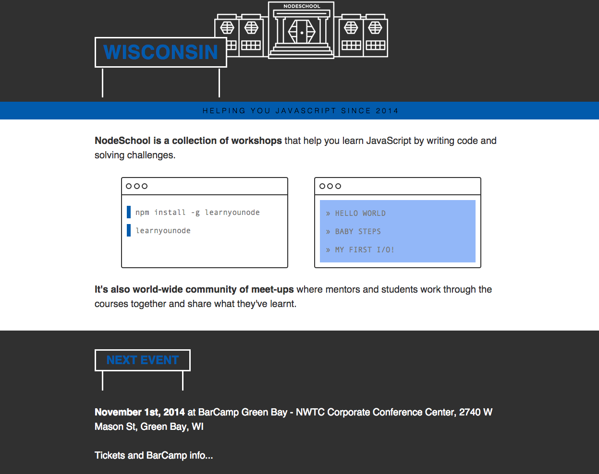

wisconsin
=========

Wisconsin chapter of nodeschool.

This repo is used for collaboration, communication, and event planning.  Attendees of nodeschool Wisconsin events will be added to the nodeschool Wisconsin team.

[We have a github page for the group here](http://nodeschool.io/wisconsin/), which is a fork of the [NodeSchool London](http://nodeschool.io/london/) site.

